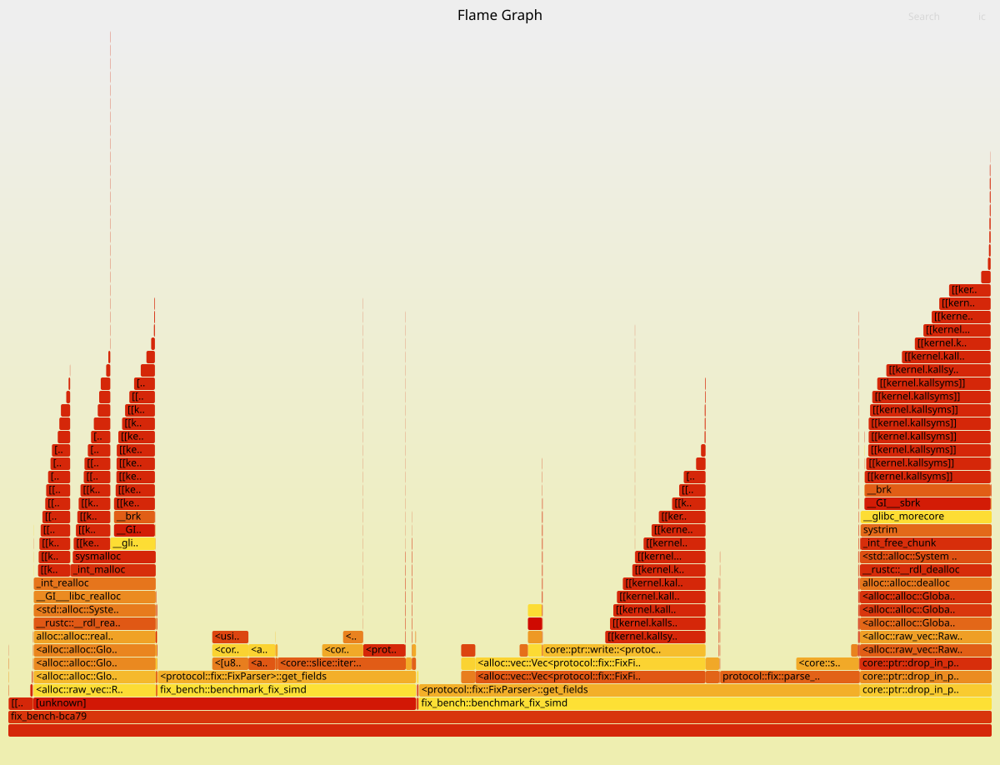
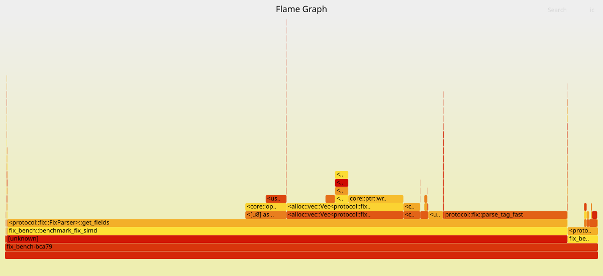

# Implementing a High-Performance FIX Message Parser in Rust

This idea of this article comes after reading a great article by Luis Soares on [Userspace TCP in Rust with DPDK for High-Frequency Trading](https://medium.com/dev-genius/userspace-tcp-in-rust-with-dpdk-for-high-frequency-trading-753e7a309588) where he implemented a userspace TCP stack in Rust using DPDK for high-frequency trading applications. Inspired by his work, I wanted to explore how to implement a high-performance FIX message parser in Rust, which is a critical component in electronic trading systems.

## Starting Point

The code is provided by Luis Soares in his article, and I will refer to it as the "scalar parser". The scalar parser works correctly but is not optimized for performance, especially when dealing with large FIX messages.

```rust
pub struct FixParser<'a> {
    data: &'a [u8],
    pos: usize,
}

impl<'a> FixParser<'a> {
    #[inline(always)]
    pub fn new(data: &'a [u8]) -> Self {
        Self { data, pos: 0 }
    }
    /// Parse the next tag=value field. Returns None at end of message.
    #[inline(always)]
    pub fn next_field(&mut self) -> Option<FixField<'a>> {
        if self.pos >= self.data.len() {
            return None;
        }
        // Parse tag (digits before '=')
        let tag_start = self.pos;
        let mut tag: u32 = 0;
        while self.pos < self.data.len() && self.data[self.pos] != EQUALS {
            // Branchless digit accumulation
            tag = tag * 10 + (self.data[self.pos] - b'0') as u32;
            self.pos += 1;
        }
        if self.pos >= self.data.len() {
            return None; // Malformed: no '='
        }
        self.pos += 1; // Skip '='
        // Parse value (bytes before SOH)
        let value_start = self.pos;
        while self.pos < self.data.len() && self.data[self.pos] != SOH {
            self.pos += 1;
        }
        let value = &self.data[value_start..self.pos];
        if self.pos < self.data.len() {
            self.pos += 1; // Skip SOH
        }
        Some(FixField { tag, value })
    }
}
```

This implementation is already quiet efficient as there is zero allocation in the hot path.

The digital accumulation in the scalar parser is a great win! In my own implementation, I first used a `String::from_utf8_lossy` to convert the byte slice into a string, and then used `convert::from_str` to parse the tag. This was significantly slower than the branchless digit accumulation approach used in the scalar parser.


## Optimizing the Parser

As discussed in the mentionned article, one way to optimize the parser is to take advantage of SIMD (Single Instruction, Multiple Data) instructions to process multiple bytes in parallel. This can significantly speed up the parsing of large FIX messages.

### What is SIMD?

SIMD is a parallel computing architecture that allows a single instruction to operate on multiple data points simultaneously. In the context of parsing FIX messages, we can use SIMD instructions to process multiple bytes of the message at once, which can significantly reduce the time it takes to parse large messages.
It relies on the fact that modern CPUs have wide registers (e.g., 128-bit, 256-bit, or even 512-bit) that can hold multiple data elements.

To sum up, instead of doing :

```rust
out[i] = a[i] + b[i];
``` 

SIMD does:

```rust
out[i..i+N] = a[i..i+N] + b[i..i+N];
```

in a single instruction, where N is the number of elements that can fit in the SIMD register.

So, you should expect a significant performance boost (up to 4x or more) when using SIMD for parsing FIX messages, especially for larger messages.

### Implementing SIMD in Rust

My computer supports AVX-512, which allows for 512-bit wide SIMD registers. This means we can process 64 bytes of the FIX message at a time (since each byte is 8 bits).

```rust
pub struct FixMessage<'a> {
    pub fields: Vec<FixField<'a>>,
}

fn find_delimiter_positions(buf: &[u8], delimiter: u8) -> Vec<usize> {
    let mut positions = Vec::new();
    let len = buf.len();
    let chunks = len / 64; // Number of full 64-byte chunks

    let delimiter_vec = u8x64::splat(delimiter);

    for i in 0..chunks {
        let offset = i * 64;

        let block = u8x64::from_slice(&buf[offset..offset + 64]);
        let mask = block.simd_eq(delimiter_vec);

        let mut bits = mask.to_bitmask();

        while bits != 0 {
            let bit = bits.trailing_zeros() as usize;
            positions.push(offset + bit);
            bits &= bits - 1;
        }
    }

    // Handle remaining bytes that don't fit into a full 64-byte chunk
    for i in (chunks * 64)..len {
        if buf[i] == delimiter {
            positions.push(i);
        }
    }

    positions
}

fn parse_tag_fast(bytes: &[u8]) -> u32 {
    let mut v = 0u32;
    for &b in bytes {
        v = v * 10 + (b - b'0') as u32;
    }
    v
}

pub fn get_fields(&mut self) -> FixMessage<'a> {
        if self.pos >= self.data.len() {
            return FixMessage { fields: Vec::new() };
        }

        let data = self.data;
        let len = data.len();
        let mut i  = self.pos;

        if i >= len {
            return FixMessage { fields: Vec::new() };
        }

        let mut fields = Vec::with_capacity(64); // At least 64 fields capacity for small messages

        let soh_vec = u8x64::splat(SOH);
    
        let mut start_field = i;

        while i + 64 <= len {
            let block = u8x64::from_slice(&data[i..i + 64]);
            let mask = block.simd_eq(soh_vec);
    
            let mut bits = mask.to_bitmask();
    
            while bits != 0 {
                let bit = bits.trailing_zeros() as usize;
                let field_end = i + bit;
    
                // Parse tag and value from data[start_field..field_end]
                if let Some(eq_pos) = data[start_field..field_end].iter().position(|&b| b == EQUALS) {
                    let tag_bytes = &data[start_field..start_field + eq_pos];
                    let value_bytes = &data[start_field + eq_pos + 1..field_end];
                    let tag = parse_tag_fast(tag_bytes);
                    fields.push(FixField { tag, value: value_bytes });
                }
    
                start_field = field_end + 1; // Move to the start of the next field
                bits &= bits - 1; // Nice trick here to clear the least set bits.
            }
    
            i += 64;
        }

        // Handle remaining bytes that don't fit into a full 64-byte chunk
        while i < len {
            if data[i] == SOH {
                let field_end = i;
                if let Some(eq_pos) = data[start_field..field_end].iter().position(|&b| b == EQUALS) {
                    let tag_bytes = &data[start_field..start_field + eq_pos];
                    let value_bytes = &data[start_field + eq_pos + 1..field_end];
                    let tag = parse_tag_fast(tag_bytes);
                    fields.push(FixField { tag, value: value_bytes });
                }
                start_field = field_end + 1;
            }
            i += 1;
        }

        FixMessage { fields }
    }
```

I used `std::simd` for the SIMD operations, which provides a safe and ergonomic API for working with SIMD in Rust.

The `find_delimiter_positions` function uses SIMD to find the positions of the SOH (Start of Header) delimiter in the FIX message, which allows us to quickly identify the boundaries of each field.

Then I use `u8x64` to process 64 bytes at a time, and a bitmask to identify the positions of the delimiters within the block. This allows us to efficiently parse the fields without having to check each byte individually.

I still need to handle the remaining bytes that don't fit into a full 64-byte chunk, but this is done in a simple loop after processing the main blocks.

I return a `FixMessage` struct that contains a vector of `FixField` structs, which represent the parsed fields from the FIX message.

### Performance Results

Let's compare the performance of the scalar parser and the SIMD-optimized parser using FIX messages of varying sizes.

```
─────────────────────────────────────────────────────────────────────────────────────────────────────────
Size         Scalar p50       SIMD p50      Δ p50     Scalar p99       SIMD p99      Δ p99
─────────────────────────────────────────────────────────────────────────────────────────────────────────
1k            551.000ns      431.000ns     +21.8%      681.000ns      531.000ns     +22.0%
4k              2.055µs        1.623µs     +21.0%        2.825µs        2.255µs     +20.2%
16k             5.491µs        6.163µs     -12.2%        8.463µs        8.551µs      -1.0%
32k            16.287µs       12.143µs     +25.4%       22.383µs       16.767µs     +25.1%
64k            20.943µs       24.479µs     -16.9%       30.863µs       33.535µs      -8.7%
128k           65.055µs       48.255µs     +25.8%       89.471µs       54.463µs     +39.1%
─────────────────────────────────────────────────────────────────────────────────────────────────────────
```

The results are not as good as I expected. The SIMD parser performs ~20% better for 1k, 4k, 32k and 128k messages, but it performs worse for 16k and 64k messages.

I expected a more consistent performance improvement across all message sizes, but it seems that the SIMD optimization is not always effective.

### Investigating the Performance

#### Perf

In a general way, when I investigate performance issues, my favorite tool is to use a profiler to see where the time is being spent. In this case, I used `perf` on Linux to profile the SIMD parser and see if there are any bottlenecks.

I run perf for scalar and SIMD parsers on a 64k message, and here are the results:

```
 Performance counter stats for './target/profiling/deps/fix_bench-bca7984a0d53c55e --bench FIX Scalar 64k --profile-time 5':

           460,429      cache-misses                                                          
         1,995,916      branch-misses                                                         
         3,406,261      L1-dcache-load-misses                                                 

       5.058290531 seconds time elapsed

       5.053620000 seconds user
       0.003998000 seconds sys
```

```
 Performance counter stats for './target/profiling/deps/fix_bench-bca7984a0d53c55e --bench FIX SIMDS 64k --profile-time 5':

        23,387,642      cache-misses                                                          
       179,849,915      branch-misses                                                         
       615,237,280      L1-dcache-load-misses                                                 

       4.998382140 seconds time elapsed

       3.148829000 seconds user
       1.797515000 seconds sys
```

The SIMD parser has significantly more cache misses and branch misses than the scalar parser, which could explain the performance degradation for certain message sizes.

The branch misses suggest that the SIMD implementation might be causing more unpredictable branches, which can lead to pipeline stalls and reduced performance. 

The cache misses suggest that the SIMD implementation might be accessing memory in a less cache-friendly way, which can also lead to performance degradation.

Also, the time spent in kernel mode for the SIMD parser is much higher than for the scalar parser, which could indicate that the SIMD implementation is causing more context switches or system calls, further impacting performance.

#### Flamegraph

To get a better understanding of where the time is being spent in the SIMD parser, I generated flamegraphs for the SIMD parser using `perf` and `flamegraph.pl`. 



This graph shows that:

- **12,43%** of the time is spent in `rdl_realloc` which is the function used by the `Vec` to grow its capacity when needed. This suggests that we might be hitting the capacity of the `Vec` and causing it to reallocate, which can be expensive.

- **13,39%** of the time is spent in `rdl_dealloc` which is the function used by the `Vec` to shrink its capacity when needed. This suggests that we might be over-allocating the `Vec` and causing it to deallocate memory, which can also be expensive.

- **13,03%** of the time is spent in `pposition` which is the function used to find the position of the `EQUALS` character in the field. This suggests that we might be doing a lot of work to find the position of the `EQUALS` character, which could be optimized.

### Optimizing Memory Allocations

To address the issue of memory allocations, we can try to estimate the number of fields in the FIX message upfront and pre-allocate the `Vec` with that capacity. This can help reduce the number of reallocations and deallocations, which can improve performance.

```rust
let estimated_fields = (len - i) / 10; // Estimate based on average field size of 10 bytes
let mut fields = Vec::with_capacity(estimated_fields.max(64)); // At least 64 fields capacity for small messages
```

After these changes, we can run the benchmarks again to see if there is an improvement in performance.

```
Performance counter stats for './target/profiling/deps/fix_bench-bca7984a0d53c55e --bench FIX SIMDS 64k --profile-time 5':

           526,790      cache-misses                                                          
         1,997,458      branch-misses                                                         
       611,795,213      L1-dcache-load-misses                                                 

       4.990579034 seconds time elapsed

       4.986993000 seconds user
       0.002999000 seconds sys
```

The system time has significantly decreased, which means the allocator overhead has been reduced.  However, the wall clock time has not improved significantly.

`L1-dcache-load-misses` is still the same than before, which suggests that the SIMD implementation is still accessing memory in a less cache-friendly way.


### Optimizing Cache Usage

If you have been following along, you might have noticed that the SIMD parser is doing more work to find the position of the `EQUALS` character in the field. It actually use the `position` method on the byte slice, which is a linear search that can be expensive, especially for larger fields.

Besides, as we access the data in a non-sequential way (first we find the SOH delimiters, then we search for the EQUALS character within each field), we might be causing more cache misses, which can degrade performance.

```rust
if let Some(eq_pos) = data[start_field..field_end].iter().position(|&b| b == EQUALS) {
                    let tag_bytes = &data[start_field..start_field + eq_pos];
                    let value_bytes = &data[start_field + eq_pos + 1..field_end];
                    let tag = parse_tag_fast(tag_bytes);
                    fields.push(FixField { tag, value: value_bytes });
                }
```

One solution can be to use SIMD to find the position of the `EQUALS` character within each field, similar to how we find the SOH delimiters. This can help reduce the time spent searching for the `EQUALS` character and improve cache usage. Let's implement this optimization and see if it improves performance.

Here is what the optimized code looks like:

```rust
pub fn get_fields(&mut self) -> FixMessage<'a> {
        if self.pos >= self.data.len() {
            return FixMessage { fields: Vec::new() };
        }

        let data = self.data;
        let len = data.len();
        let mut i  = self.pos;

        if i >= len {
            return FixMessage { fields: Vec::new() };
        }

        // Estimate capacity better upfront
        let estimated_fields = (len - i) / 10;
        let mut fields = Vec::with_capacity(estimated_fields.max(64)); // At least 64 fields capacity for small messages

        let soh_vec = u8x64::splat(SOH);
        let equal_vec = u8x64::splat(EQUALS);
    
        let mut start_field = i;

        while i + 64 <= len {
            let block = u8x64::from_slice(&data[i..i + 64]);
            let soh_mask = block.simd_eq(soh_vec).to_bitmask();
            let equal_mask = block.simd_eq(equal_vec).to_bitmask();
      
            let mut soh_bits = soh_mask;

            while soh_bits != 0 {
                let bit = soh_bits.trailing_zeros() as usize;
                let field_end = i + bit;
    
                // Check if the field start is in this block, if not, we need to look for the '=' in the previous block
                let range_mask = if start_field >= i {
                    // field started in this block
                    let range_start = start_field - i;
                    let window = ((1u64 << bit) - 1) & !((1u64 << range_start) - 1);
                    equal_mask & window
                } else {
                    // field started in previous block, but = might still be in this block
                    // if start_field is only slightly behind i (field spans the boundary)
                    // search from bit 0 up to soh_bit
                    let window = (1u64 << bit) - 1;  // bits 0..soh_bit
                    let mask = equal_mask & window;
                    if mask != 0 {
                        mask  // = is in this block, before the SOH
                    } else {
                        0     // = is truly in a previous block, scalar fallback
                    }
                };

                let eq_pos_abs = if range_mask != 0 {
                    // = found in this block
                    i + range_mask.trailing_zeros() as usize
                } else {
                    // = is in a previous block, scan scalar (rare for well-formed FIX)
                    match data[start_field..field_end].iter().position(|&b| b == EQUALS) {
                        Some(p) => start_field + p,
                        None    => { soh_bits &= soh_bits - 1; continue; }
                    }
                };

                let tag_bytes   = &data[start_field..eq_pos_abs];
                let value_bytes = &data[eq_pos_abs + 1..field_end];
                let tag         = parse_tag_fast(tag_bytes);
                fields.push(FixField { tag, value: value_bytes });

                start_field  = field_end + 1;
                soh_bits    &= soh_bits - 1;
            }
    
            i += 64;
        }

        // Handle remaining bytes that don't fit into a full 64-byte chunk
        while i < len {
            if data[i] == SOH {
                let field_end = i;
                if let Some(eq_pos) = data[start_field..field_end].iter().position(|&b| b == EQUALS) {
                    let tag_bytes = &data[start_field..start_field + eq_pos];
                    let value_bytes = &data[start_field + eq_pos + 1..field_end];
                    let tag = parse_tag_fast(tag_bytes);
                    fields.push(FixField { tag, value: value_bytes });
                }
                start_field = field_end + 1;
            }
            i += 1;
        }

        FixMessage { fields }
    }
```

After implementing this optimization, we can run the benchmarks again to see if there is an improvement in performance.

```
────────────────────────────────────────────────────────────────────────────────────────────────────────────
Size     SIMD p50 (Before)   SIMD p50 (After)    Δ p50     SIMD p99 (Before)   SIMD p99 (After)    Δ p99
────────────────────────────────────────────────────────────────────────────────────────────────────────────
1k          431.000ns           371.000ns       +13.9%        531.000ns           391.000ns       +26.4%
4k            1.623µs             1.333µs       +17.9%          2.255µs             1.422µs       +36.9%
16k           6.163µs             5.263µs       +14.6%          8.551µs             6.235µs       +27.1%
32k          12.143µs            10.471µs       +13.8%         16.767µs            13.375µs       +20.2%
64k          24.479µs            20.847µs       +14.8%         33.535µs            24.911µs       +25.7%
128k         48.255µs            41.695µs       +13.6%         54.463µs            47.711µs       +12.4%
────────────────────────────────────────────────────────────────────────────────────────────────────────────
```

The performance has improved significantly across all message sizes, with improvements ranging from ~14% to ~37%. This suggests that optimizing the cache usage by using SIMD to find the position of the `EQUALS` character has a significant impact on performance.

### Flamegraph After Optimization

And because we love flamegraphs, here is the new flamegraph for the SIMD parser after the optimization:



It shows that:

- 19,71% is spent in `Vec::push()`
- 20,83% is spent in `parse_tag_fast()`

#### Statistics after optimization

```
 Performance counter stats for './target/profiling/deps/fix_bench-bca7984a0d53c55e --bench FIX SIMDS 64k --profile-time 5':

           357,137      cache-misses                                                          
         1,308,003      branch-misses                                                         
       321,984,635      L1-dcache-load-misses                                                 

       3.143171536 seconds time elapsed

       3.138997000 seconds user
       0.003999000 seconds sys
```

It reflects the improvements we see in the flamegraph, with a significant reduction in cache misses and branch misses, which contributes to the overall performance improvement of the SIMD parser.

## Conclusion

In this article, we explored how to implement a high-performance FIX message parser in Rust using SIMD instructions. We started with a scalar parser and then optimized it by using SIMD to find the positions of delimiters and the `EQUALS` character, as well as optimizing memory allocations.

Feel free to comment if you have any questions or suggestions for further optimizations!