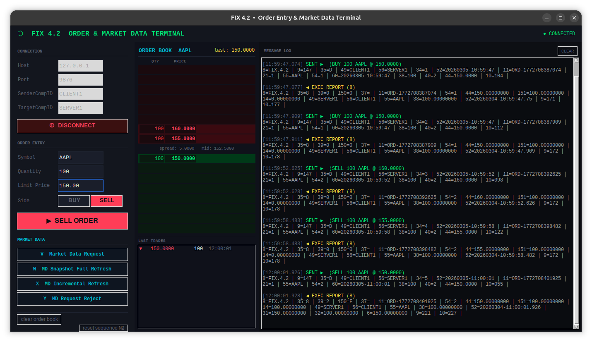

# Building a Financial Market Simulator in Rust

This project is a financial market simulator implemented in Rust. It consists of several crates that work together to simulate a financial market, including an order book, a matching engine, a FIX protocol engine, and a TCP server to handle client connections and process orders.

## Architecture

The architecture of the market simulator is designed to allow for modularity and separation of concerns. Each crate is responsible for a specific aspect of the market simulation, and they communicate with each other through custom ring buffer channels to ensure low-latency processing of orders and generation of execution reports.

Here is the high-level architecture of the market simulator:
```
                    CPU 0
              ┌───────────────┐
              │   Network RX  │
              └───────┬───────┘
                      │
              crossbeam::channel
                      │
                      ▼
                    CPU 2
              ┌───────────────┐
              │   FIX Server  │
              │   (decoder)   │
              └───────┬───────┘
                      │
                 SPSC ring buffer
                      │
                      ▼
                    CPU 4
              ┌───────────────┐
              │   Order Book  │
              │ Matching Eng. │
              └───────┬───────┘
                      │
                 SPSC ring buffer
                      │
                      ▼
                    CPU 6
              ┌──────────────────┐
              │ Execution Report │
              │    Processor     │
              └───────┬──────────┘
                      │
                 SPSC ring buffer
                      │
                      ▼
                    CPU 8
              ┌───────────────┐
              │   FIX Server  │
              │   (encoder)   │
              └───────┬───────┘
                      │
              Crossbeam::channel
                      │
                      ▼
                    CPU 10
              ┌───────────────┐
              │   Network TX  │
              └───────────────┘
```

My computer has 6 cores which are hyperthreaded, so I have 12 logical CPUs. I want each of my component to run on a separate core to avoid contention and ensure that each component can process orders and generate execution reports as quickly as possible.

## Project Structure

Before going in detail about each component, here is the structure of the project:

```
.
├── benches
│   └── benches.rs
├── Cargo.lock
├── Cargo.toml
├── config
│   ├── fifo-spec.json
│   └── src
├── crates
│   ├── execution-report
│   │   ├── benches
│   │   │   └── bench.rs
│   │   ├── Cargo.toml
│   │   ├── README.md
│   │   └── src
│   │       └── lib.rs
│   ├── logging
│   │   ├── Cargo.toml
│   │   ├── README.md
│   │   └── src
│   │       └── lib.rs
│   ├── memory
│   │   ├── Cargo.toml
│   │   └── src
│   │       └── lib.rs
│   ├── order-book
│   │   ├── Cargo.toml
│   │   ├── logs
│   │   │   └── order_book.log
│   │   ├── README.md
│   │   └── src
│   │       ├── lib.rs
│   │       └── order_book.rs
│   ├── protocol
│   │   └── FIX
│   │       ├── benches
│   │       │   └── fix.rs
│   │       ├── Cargo.toml
│   │       ├── examples
│   │       │   └── profile_simd.rs
│   │       ├── README.md
│   │       └── src
│   │           ├── engine.rs
│   │           ├── lib.rs
│   │           ├── parser.rs
│   │           └── tags.rs
│   ├── server
│   │   ├── Cargo.toml
│   │   ├── README.md
│   │   └── src
│   │       ├── lib.rs
│   │       └── tcp.rs
│   ├── types
│   │   ├── Cargo.toml
│   │   └── src
│   │       └── lib.rs
│   └── utils
│       ├── Cargo.toml
│       └── src
│           └── lib.rs
├── README.md
├── src
│   └── main.rs
└── tools
    └── client.py
```

I organized the project into several crates, each responsible for a specific aspect of the market simulation: 
- `server` crate contains the implementation of the TCP server and the FIX protocol engine
- `order-book` crate contains the implementation of the order book and matching engine
- `execution-report` crate is responsible for processing order results and generating execution reports
- `protocol` crate contains the implementation of the FIX protocol parsing and encoding
- `memory` crate contains utilities for managing shared memory and implementing custom ring buffer channels
- `logging` crate provides logging functionality for debugging and monitoring purposes
- `types` crate defines common data types used across the different components

If you have been using Rust for large project, you might have noticed that the compilation times can become quite long as the project grows in size. By organizing the project into multiple crates, I can take advantage of Rust's incremental compilation and only recompile the crates that have changed, which can significantly reduce compilation times during development.

### TCP Server

The TCP Server component is responsible for receiving incoming FIX messages from clients over the network. It listens for incoming TCP connections and reads the data sent by clients. Once a complete FIX message is received, it sends the message to the FIX Server (decoder) through a crossbeam channel for further processing.

I used `std::net::{TcpListener, TcpStream};` for handling TCP connections and `crossbeam::channel` for communication between the TCP Server and the FIX Server (decoder).

Each time a new client connects, the TCP Server spawns a new thread to handle the communication with that client, allowing for concurrent handling of multiple clients. Each thread owns the sender side of the crossbeam channel to send messages to the FIX Server, which is a multiple producer single consumer (MPSC) channel.

```rust
pub struct FixServer<const N: usize> {
    fifo_in: RequestQueue<N>,
    shutdown: Arc<AtomicBool>,
}

impl <'a, const N: usize> FixServer<N> {
    pub fn new(fifo_in: RequestQueue<N>) -> Self {
        Self { fifo_in, shutdown: Arc::new(AtomicBool::new(false)) }
    }

    pub fn accept_loop(&self, listener: TcpListener) {
        for stream in listener.incoming() {
            let stream = stream.unwrap();
            // Disable Nagle's algorithm for lower latency
            stream.set_nodelay(true).unwrap();

            let queue = Arc::clone(&self.fifo_in);
            let shutdown = Arc::clone(&self.shutdown);

            // Spawn a thread to handle this client connection
            std::thread::spawn(move || {
                Self::handle_client(stream, queue, shutdown);
            });
        }
    }

    pub fn handle_shutdown(&self) -> StopHandle {
        StopHandle { 
            shutdown: Arc::clone(&self.shutdown),
            thread: None,
        }
    }

    fn handle_client(
        mut stream: TcpStream,
        queue:   RequestQueue<N>,
        shutdown: Arc<AtomicBool>,
    ) {

        let (response_tx, response_rx) = unbounded();
        let mut buf = [0u8; 4096];

        while !shutdown.load(Ordering::Relaxed) {
            match stream.read(&mut buf) {
                Ok(0) => {
                    eprintln!("Client disconnected");
                    break
                }, // no message, client closed connection
                Ok(n) => {
                    let mut msg = FixRawMsg::default();
                    msg.len = n as u16;
                    msg.data[..n].copy_from_slice(&buf[..n]);
                    msg.resp_queue = Some(response_tx.clone());

                    while let Err(backup_msg) = queue.push(msg) {
                        msg = backup_msg;
                        std::thread::yield_now(); // backpressure: yield to allow the FIX engine to catch up
                    }

                    loop {
                        if let Ok(response) = response_rx.recv() {
                            if let Err(e) = stream.write_all(&response.data[..response.len as usize]) {
                                eprintln!("Failed to send response to client: {}", e);
                                break;
                            }
                            break; // response sent, go back to reading from the client
                        } else {
                            continue; // no more responses, go back to reading from the client
                        }
                    }
                }
                Err(_) => break,
            }
        }
    }
}
```

### FIX Server

The FIX Server is responsible for decoding incoming FIX messages, extracting relevant fields, and converting them into order events that can be processed by the order book and matching engine. It also keeps track of pending orders, as it is responsible for replying to the client with execution reports.

FIX parsing has already been discussed here so I won't go into too much detail about the implementation.

The FIX Engine struct looks like this:

```rust
pub struct FixEngine<'a, const N: usize> {
    request_in: Arc<ArrayQueue<FixRawMsg<N>>>,
    request_out: Producer<'a, OrderEvent, N>,
    response_in: Consumer<'a, (EntityId, FixRawMsg<N>), N>, // For future use if we want to send execution reports back to the FIX engine
    counter: usize,
    shutdown: Arc<AtomicBool>,
    pending: HashMap<EntityId, crossbeam_channel::Sender<FixRawMsg<N>>>, // Map of pending order events waiting for responses. Keyed by a unique identifier Brocker ID.
}
```

- `request_in` is the receiver side of the crossbeam channel that receives raw FIX messages from the Network RX component. The FIX Server will read messages from this channel, decode them, and convert them into order events.
- `request_out` is the producer side of the SPSC ring buffer channel that sends order events to the order book and matching engine for processing.
- `response_in` is the consumer side of the SPSC ring buffer channel that receives execution reports from the execution report generator. In the current implementation, this channel is not used, but it could be used in the future to allow the FIX Server to receive execution reports and send them back to.
- `pending` field is a HashMap that keeps track of pending order events waiting for responses. Each entry in the HashMap is keyed by a unique identifier (EntityId) that represents the order event, and the value is a crossbeam channel sender that can be used to send the execution report back to the client once it is received from the execution report generator.

### Order Book and Matching Engine

The order book is responsible for maintaining the list of buy and sell orders in the market. It provides functionality for adding, removing, and matching orders. The matching engine is responsible for processing incoming orders, matching them against existing orders in the order book, and generating order results for later processing by the execution report generator.

The main structure of the order book looks like this:

```rust
pub struct OrderBookEngine<'a, const N: usize> {
    fifo_in: Consumer<'a, OrderEvent, N>,
    fifo_out: Producer<'a, (OrderEvent, OrderResult), N>,
    order_book: OrderBook,
    shutdown: Arc<AtomicBool>,
}
```

```rust
pub struct OrderBook {
    pub bids: BTreeMap<FixedPointArithmetic, VecDeque<OrderEvent>>,
    pub asks: BTreeMap<FixedPointArithmetic, VecDeque<OrderEvent>>,
    id_counter: TradeId, // Counter for generating unique trade IDs, using a fixed-size array for simplicity
}
```

There order book maintains two binary heaps, one for bids and one for asks. The bids are stored in a max-heap (using `BTreeMap<FixedPointArithmetic, VecDeque<OrderEvent>>`) to allow for efficient retrieval of the highest bid, while the asks are stored in a min-heap (using `BTreeMap<FixedPointArithmetic, VecDeque<OrderEvent>>`) to allow for efficient retrieval of the lowest ask.

#### Discussion about data structures for the order book

I initially considered using a `BinaryHeap` for both bids and asks, but I realized that I needed to be able to efficiently access and modify the orders at the best bid and best ask prices. A binary heap does not allow for efficient access to arbitrary elements, which would make it difficult to update the quantities of orders at the best bid and ask prices after a trade is executed.

```
| Operation  | BTree Map Complexity | Binary Heap Complexity |
| ---------- | -------------------- | ---------------------- |
| Add order  |       O(log n)       |        O(log n)        |
| Cancel     |       O(1)           |        O(n)            |
| Match best |       O(log n)       |        O(1)            |
| Modify     |       O(1)           |        O(n)            |
```

Here is an example of how the matching engine processes incoming orders:

```rust
fn process_sell_limit_order(&mut self, mut order: OrderEvent) -> OrderResult {
        let original_quantity = order.quantity;
        let mut trades: Vec<Trade> = Vec::with_capacity(16); // 16 for now, to be adjusted based on expected trade volume per order
        while let Some((&best_bid_price, _ )) = self.bids.first_key_value() {
            if best_bid_price >= order.price {
                // There is a matching bid, so we need to process the trades against the orders in the best bid queue
                let mut best_bid_queue = self.bids.pop_first().unwrap().1;

                while let Some(mut best_bid) = best_bid_queue.pop_front() {
                    let trade_quantity = order.quantity.min(best_bid.quantity);
                    // Process the trade here (e.g., update quantities, record the trade, etc.)
                    best_bid.quantity -= trade_quantity;
                    order.quantity -= trade_quantity;

                    // Add the trade to the list of trades for this order
                    trades.push(Trade {
                        price: best_bid.price,
                        quantity: trade_quantity,
                        id: self.id_counter, // Example trade ID
                    });

                    self.id_counter.increment(); // Increment the trade ID counter
            
                    if best_bid.quantity > FixedPointArithmetic::ZERO {
                        best_bid_queue.push_front(best_bid);
                    }
                    // Update the incoming order's quantity

                    if order.quantity == FixedPointArithmetic::ZERO {
                        if !best_bid_queue.is_empty() {
                            self.bids.insert(best_bid_price, best_bid_queue);
                        }

                        return self.generate_order_result(&order, Some(OrderStatus::Filled), original_quantity, trades);
                    }
                }
            } else {
                break;
            }
        }

        let order_result = self.generate_order_result(&order, None, original_quantity, trades);

        if order.quantity > FixedPointArithmetic::ZERO {
            self.asks
            .entry(order.price)
            .or_insert_with(VecDeque::new)
            .push_back(order);
        }

        order_result
    }
```

#### Discussion about fixed-point arithmetic

I implemented `FixedPointArithmetic` struct which allows us to process orders with fixed-point arithmetic. Floating point ALU operations can be significantly more expensive than integer ALU operations. By using fixed-point arithmetic, we can represent prices and quantities as integers, which can be processed more efficiently by the CPU. This is especially important in a high-frequency trading environment where low latency is crucial.
For example, a price of 123.45678901 would be represented as 12345678901 in the fixed-point representation.

### Execution Report Generator

The execution report generator is responsible for processing the order results generated by the matching engine and creating execution reports that can be sent back to clients. It receives order results from the order book and matching engine through a SPSC ring buffer channel, processes them, and sends the execution reports back to the FIX Server (encoder) through another SPSC ring buffer channel.

```
pub struct ExecutionReportEngine<'a, const N: usize> {
    fifo_in: Consumer<'a, (OrderEvent, OrderResult), N>,
    fifo_out: Producer<'a, (EntityId, FixRawMsg<N>), N>,
    shutdown: Arc<AtomicBool>,
}
```

Note that I send back a tuple of `(EntityId, FixRawMsg<N>)` to the FIX Server (encoder) instead of just the `FixRawMsg<N>`. This is because the FIX Server needs to know which client to send the execution report back to, and the `EntityId` serves as a unique identifier for the order event that generated the execution report. The FIX Server can use this `EntityId` to look up the corresponding client connection and send the execution report back to the correct client.

### Client

In order the send orders to the market simulator, clients need to connect to the TCP server and send FIX messages. The client can be implemented in any programming language that supports TCP connections and can construct FIX messages according to the FIX protocol specification.

I've implemented python client that can connect to the TCP server, send FIX messages, and receive execution reports. The client uses the `socket` library to handle TCP connections and constructs FIX messages as byte strings according to the FIX protocol specification.

It also display the state of the order book, the spread, and all transaction made in the market. This allows us to see how the market evolves in response to the orders sent by the client.



### Benchmarking and Performance

I used `criterion` crate to benchmark the latency of each component in the market simulator. Each component is pinned on a non-isolated core and I measured the latency from the moment it enter and exit each component through the SPSC ring buffer channels. The results are as follows:

```
Name                 │   p50 (ns) │   p99 (ns) │  p999 (ns) │   vs base
────────────────────────────────────────────────────────────────────────
Order Book           │        681 │       1914 │       4371 │      1.00x
Execution Report     │       1983 │       3899 │       7615 │      2.91x
FIX Engine           │      10783 │      15015 │      50623 │     15.83x
Overall              │      30047 │      39423 │     157055 │     44.12x
```

The order book and execution report generator have very low latency, with p50 latencies of 681ns and 1983ns respectively. The FIX Engine has a higher latency, with a p50 latency of 10783ns, which is expected due to the complexity of parsing FIX messages and generating execution reports. The overall latency from receiving an order to sending back an execution report is around 30 microseconds at p50, which is quite good for a market simulator.

However, there is still room for optimization, especially in the FIX Engine. I could consider using a more efficient FIX parsing library or optimizing the way execution reports are generated and sent back to clients to further reduce latency. 
p999 latency is however much higher than p50, which needs to be investigated further to identify the cause of the outliers and optimize the system to reduce them.

### Multi-threading or Multi-processing?

Both architectures have their own advantages and disadvantages which are sum up in the table below:

| Aspect                | Multi-threading                          | Multi-processing                          |
|-----------------------|------------------------------------------|-------------------------------------------|
| CPU overhead          | cost of fork() or clone(), MMU management for adresse spaces.                        | Small. threads API (`std::thread`)               |
| Memory overhead       | Separate address space per process       | Small, required only extra stack and registers              |
| Communication         | Inter-process communication (IPC) can be complex and slower due to context switching and data copying. | Intra-process communication is typically faster and easier to implement using shared memory or message passing. It need synchronization mechanisms like mutexes or condition variables. |
| Fault isolation       | Processes are isolated from each other, so a crash in one process does not affect others. | Threads share the same address space, so a crash in one thread can potentially bring down the entire application. |

In the context of a market simulator, multi-threading is often preferred due to its lower overhead and faster communication between components. However, I decided to created my FIFO on shared memory in case multi-process is needed in the future to further isolate components and improve fault tolerance.

```rust
pub struct SharedQueue<'a, const N: usize, T> {
    _mmap: MmapMut,  // keeps the mapping alive
    pub queue: &'a mut RingBuffer<T, N>,
}

pub fn open_shared_queue<'a, const N: usize, T>(name: &str, create: bool) -> SharedQueue<'a, N, T> {
    let size = std::mem::size_of::<RingBuffer<T, N>>();

    let file = match OpenOptions::new()
        .read(true)
        .write(true)
        .create(create)
        .open(format!("/dev/shm/{}", name))  // /dev/shm is RAM-backed on Linux
    {
        Ok(file) => file,
        Err(e) => panic!("Failed to open shared queue file: {}", e),
    };

    file.set_len(size as u64).unwrap();
    let mut mmap = unsafe { MmapMut::map_mut(&file).unwrap() };

    let queue_ptr = mmap.as_mut_ptr() as *mut RingBuffer<T, N>;

    if create {
        unsafe { RingBuffer::init(queue_ptr) };
    }

    let queue = unsafe { &mut *queue_ptr };

    SharedQueue {
        _mmap: mmap,
        queue,
    }
}
```

# Conclusion and Future Work

In conclusion, I have implemented a market simulator in Rust that consists of several components working together to simulate a financial market. The architecture is designed to allow for modularity and separation of concerns, with each component running on a separate core to ensure low latency processing of orders and generation of execution reports.

I plan to implement additional features in the future, such as support for more complex order types (e.g., stop orders, iceberg orders). I also want to implement Market Data Generator that can generate market data (e.g., price updates, order book snapshots) and send it to clients in real-time. This would allow clients to have a more realistic view of the market and make informed trading decisions based on the current state of the market

