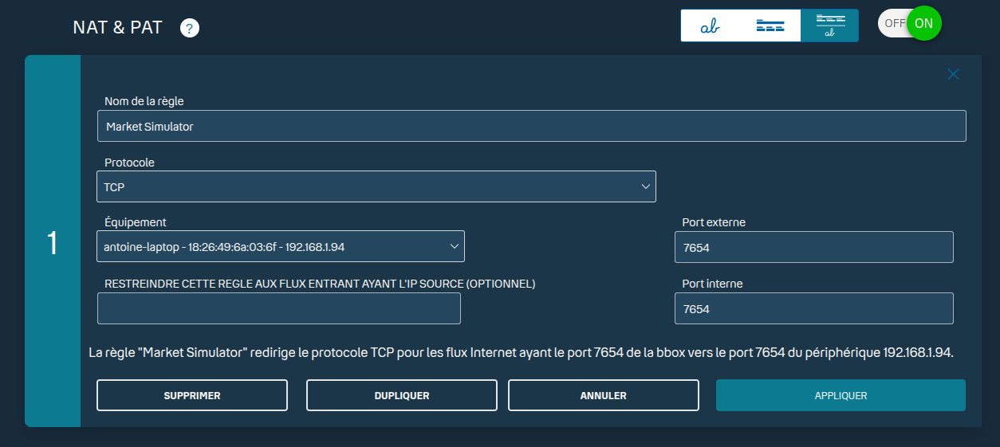

# How to use the web server

## Start the server

```bash
cd tools
python fix_web_terminal.py --https --password <yourSecretPassword>
```

All options for the `fix_web_terminal.py` script can be found by running:

```bash
usage: fix_web_terminal.py [-h] [--http-port HTTP_PORT] [--fix-host FIX_HOST] [--fix-port FIX_PORT] [--password PASSWORD] [--cert CERT] [--key KEY] [--https]

FIX 4.2 Web Terminal

options:
  -h, --help            show this help message and exit
  --http-port HTTP_PORT
                        HTTP/HTTPS port (default: 7654)
  --fix-host FIX_HOST   FIX server host
  --fix-port FIX_PORT   FIX server port
  --password PASSWORD   Password for browser login (recommended when exposed to internet)
  --cert CERT           TLS cert file (.pem). If omitted with --https, auto-generates self-signed.
  --key KEY             TLS key file (.pem)
  --https               Enable HTTPS (TLS)
```

## Access the web terminal

Open your web browser and navigate to `https://localhost:<port>`. You will be prompted to enter the password you set when starting the server. After entering the correct password, you will have access to the web terminal.

## Accessing from internet

If you want to access the web terminal from the internet, you need to ensure that your server is accessible from outside your local network. This typically involves:

1. **Port Forwarding**: Configure your router to forward the port you specified (default is 7654) to the internal IP address of the machine running the web server.
2. **Firewall Rules**: Ensure that your server's firewall allows incoming connections on the specified port.
3. **Use a Public IP or Domain**: Instead of `localhost`, you will need to use your server's public IP address or a domain name that points to it.

**Important Security Note**: Exposing the web terminal to the internet can pose security risks. Always use a strong password, and consider additional security measures such as IP whitelisting or VPN access to restrict who can connect to the server.

### Get Public IP Address

```bash
curl ifconfig.me
curl -4 ifconfig.me
```

### Port Forwarding Example

Connect to your router's admin interface and look for the port forwarding section. Create a new port forwarding rule that forwards the external port (e.g., 7654) to the internal IP address of your server on the same port.



### Firewall Rule Example

```bash
# Allow port 7654 through the firewall
sudo ufw allow 7654/tcp
```

### Connecting to the Web Terminal

Once you have set up port forwarding and firewall rules, you can access the web terminal from any device with internet access by navigating to `https://<your-public-ip>:<port>`. Remember to replace `<your-public-ip>` with your actual public IP address and `<port>` with the port number you configured.