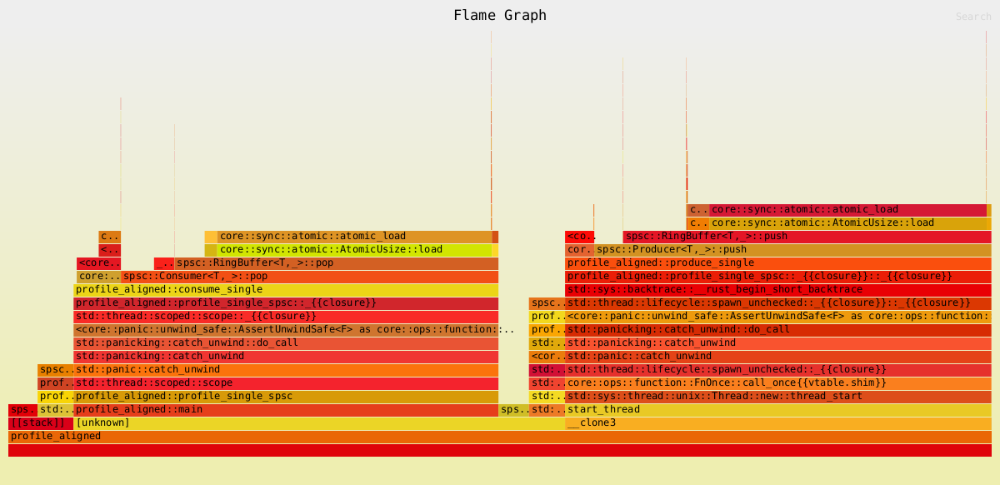

# Custom implementations for Single Producer Single Consumer (SPSC) Ring Buffer in Rust.

Use crossbeam for cache padding and atomic operations.
Use MaybeUninit for uninitialized memory handling -> better performance.
Lock-free implementation for high-performance scenarios.


## Running Tests
```rust
cargo test
```

## Running Benchmarks

I will use the `criterion` crate for benchmarking the performance of the ring buffer. To run the benchmarks, use the following command:

```rust
cargo bench
```

I compare my implementation with the `crossbeam` crate's `ArrayQueue` implementation, which is a well-known lock-free queue in Rust. The benchmarks will help us understand the performance characteristics of our custom ring buffer compared to a widely used implementation.

The last benchmark results are :

```
╔══════════════════════════════════════════════════════╗
║          SPSC Queue Latency Comparison               ║
║          (1000000 iterations per benchmark)          ║
╠══════════════════════════════════════════════════════╣
║ Metric      │ RingBuffer │ Crossbeam   │ Difference  ║
╠═════════════╪════════════╪═════════════╪═════════════╣
║ p50 latency │  137471 ns │   164607 ns │   1.20x     ║
║ p99 latency │  168575 ns │   195839 ns │   1.16x     ║
╚═════════════╧════════════╧═════════════╧═════════════╝
  ✓ RingBuffer is 1.20x faster at p50
  ✓ RingBuffer is 1.16x faster at p99
```

## Documentation

I wrote several papers to explain the design decisions and implementation details of the ring buffer. You can find them in the `papers` directory. Here are some of the key papers:

- [Cache Management in Lock-Free Data Structures](papers/cache-management.md)

## Profiling
To profile the ring buffer performance, use the `profile.rs` script located in the `src/bin` directory. You can run it using:
```rust
RUSTFLAGS="-C force-frame-pointers=yes" cargo build --bin profile --profile profiling
perf stat -e   cycles,instructions,branches,branch-misses   ./target/profiling/profile
perf stat -e cache-misses,cache-references,LLC-loads,LLC-load-misses target/profiling/profile
RUSTFLAGS="-C force-frame-pointers=yes" cargo flamegraph --bin profile --profile profiling
perf record -F 997 -g --call-graph dwarf -o perf.data ./target/profiling/profile
perf script -i perf.data | inferno-collapse-perf | inferno-flamegraph > flamegraph.svg
```

Flamegraph will help us visualize the call stack and identify any bottlenecks in our implementation.
Here is an example of a flamegraph generated from the profiling data:



We can see that the `RingBuffer::push` and `RingBuffer::pop` functions are the most time-consuming parts of the code, which is expected since they are responsible for adding and removing items from the buffer.