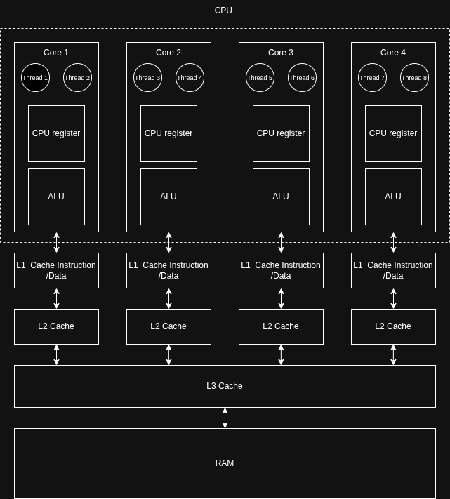

# Understanding Cache Management to Optimize Performance

While I was coding a lock-free ring buffer in Rust, I encountered some performance issues. After some investigation, I realized that the problem was related to cache management. In this article, I will explain what cache management is and how it can affect the performance of your code.


## CPU, Core, and Memory Concepts

### CPU and Cores

Before diving into cache management, it's important to understand some basic concepts about the CPU and its cores. The CPU (Central Processing Unit) is the brain of the computer, responsible for executing instructions. A core is a processing unit within the CPU that can execute instructions independently. Modern CPUs often have multiple cores, allowing them to perform multiple tasks simultaneously. 

In this article, I will use my computer's CPU as an example to explain cache management. Here is the output of the `lscpu` command, which provides information about the CPU architecture and capabilities:

```
lscpu
Architecture:                            x86_64
CPU op-mode(s):                          32-bit, 64-bit
Address sizes:                           39 bits physical, 48 bits virtual
Byte Order:                              Little Endian
CPU(s):                                  8
On-line CPU(s) list:                     0-7
Vendor ID:                               GenuineIntel
Model name:                              11th Gen Intel(R) Core(TM) i5-1135G7 @ 2.40GHz
CPU family:                              6
Model:                                   140
Thread(s) per core:                      2
Core(s) per socket:                      4
Socket(s):                               1
Stepping:                                1
CPU(s) scaling MHz:                      24%
CPU max MHz:                             4200,0000
CPU min MHz:                             400,0000
BogoMIPS:                                2764,80

arch_capabilities
Virtualization:                          VT-x
L1d cache:                               192 KiB (4 instances)
L1i cache:                               128 KiB (4 instances)
L2 cache:                                5 MiB (4 instances)
L3 cache:                                8 MiB (1 instance)
NUMA node(s):                            1
NUMA node0 CPU(s):                       0-7
```

Not a horse power but the important information displayed here are :

- The CPU has 4 cores and 8 threads, which means that each core can handle 2 hardware threads simultaneously.
- The CPU has a L1 data cache of **192 KiB**, a L1 instruction cache of **128 KiB**, a L2 cache of **5 MiB**, and a L3 cache of **8 MiB**.
- There is only one NUMA node, which means that all the cores share the same memory. (more about NUMA later).


If I want to draw a diagram of the CPU architecture, it would look something like this:



### Memory Hierarchy

The memory hierarchy is a way to organize the different types of memory in a computer system based on their speed and size. The hierarchy typically consists of the following levels:

1. **Registers**: These are the fastest and smallest type of memory, located inside the CPU. They are used to store temporary data and instructions that the CPU is currently processing.

2. **L1 Cache**: This is the first level of cache, located on the same chip as the CPU core. It is divided into two parts: L1 data cache (L1d) and L1 instruction cache (L1i). The L1 cache is very fast but has a small capacity.

3. **L2 Cache**: This is the second level of cache, also located on the same chip as the CPU core. It is larger than the L1 cache but slower.

4. **L3 Cache**: This is the third level of cache, located on a separate chip from the CPU cores. It is shared among all the cores and has a larger capacity than the L2 cache but is slower.

5. **Main Memory (RAM)**: This is the primary memory of the computer, where programs and data are stored while they are being used. It is much slower than the cache but has a much larger capacity.

6. **Secondary Storage**: This includes hard drives and solid-state drives, where data is stored permanently. It is the slowest type of memory but has the largest capacity.

Here is an example timescale for accessing data from different levels of the memory hierarchy:

| Event       | Latency |
|-------------------|----------------------|
| 1 CPU cycle         | 0,3 ns                    |
| L1 Cache cache access         | 0,9 ns                    |
| L2 Cache cache access          | 3 ns                   |
| L3 Cache cache access          | 10 ns                   |
| Main Memory (RAM) access | 100 ns                  |
| Solid State Drive access (SSD) | 10 - 100 us                |
| Rotating Hard Drive access (HDD) | 1 - 10 ms            |

CPU cycle is defined by the clock speed of the CPU. My the CPU has a clock speed of 2.4 GHz, then one CPU cycle takes approximately 0.3 nanoseconds (ns). This means that accessing data from the L1 cache is about 3 times slower than a CPU cycle, while accessing data from the main memory is about 333 times slower than a CPU cycle.

If a program accesses data that is not in the cache, it has to fetch it from the main memory, which can significantly slow down the performance of the program. Therefore, it is important to optimize the use of the cache to improve performance.

### Cache Coherence Protocol

In a multi-core CPU, each core has its own cache. When multiple cores access the same memory location, they may have different copies of the data in their caches. This can lead to inconsistencies and errors if one core updates the data while another core is reading it. To address this issue, CPUs implement a cache coherence protocol.

Even if cache coherence protocol are mainly proprietary and specific to each CPU architecture, It is possible to understand the general principles behind them. The main idea is to ensure that all cores see a consistent view of memory, even if they have different copies of the data in their caches.

The cache reads and writes memory in blocks of 64 bytes, even if only a single byte was requested. These blocks are often called **cache lines**.

My CPU (11th Gen Intel(R) Core(TM) i5-1135G7) implements the MESIF protocol, which stands for Modified, Exclusive, Shared, Invalid, and Forward. This protocol defines the states of cache lines and the rules for transitioning between them to maintain cache coherence.
Let's define these states:

- **Modified (M)**: The cache line is modified and is the only copy in the system. If other cores want to access this cache line, they must first obtain it from the core that has it in the Modified state.

- **Exclusive (E)**: The cache line is not modified and is the only copy in the system. If other cores want to access this cache line, they can read it without any issues.

- **Shared (S)**: The cache line is not modified and may be present in multiple caches. If a core wants to modify this cache line, it must first obtain exclusive access to it.

- **Invalid (I)**: The cache line is invalid and cannot be used. If a core wants to access this cache line, it must fetch it from main memory.

- **Forward (F)**: The cache line is not modified and is the designated responder for requests for this cache line. This state helps optimize the communication between caches by reducing the number of responses to requests.

I will showcase how the MESIF procol works later in this article when I will explain the performance issues I encountered with my lock-free ring buffer implementation.

### NUMA (Non-Uniform Memory Access)

In a NUMA system, the memory is divided into multiple nodes, and each node is associated with a specific set of CPU cores. Each node has its own local memory, and accessing memory from a different node (remote memory) can be slower than accessing local memory. This is because the data has to travel through an interconnect between the nodes, which can introduce latency.

In my setup, there is only one NUMA node, which means that all the cores share the same memory. However, in a system with multiple NUMA nodes, it is important to consider the memory access patterns of your program to optimize performance. For example, if a thread running on one core frequently accesses data that is stored in the local memory of another node, it may experience slower performance due to the increased latency of accessing remote memory.

## Implementation of a Lock-Free Ring Buffer

A ring buffer, also known as a circular buffer, is a data structure that uses a fixed-size buffer as if it were connected end-to-end. It is commonly used in scenarios where data is produced and consumed at different rates, such as in producer-consumer problems. In my implemetation, I only allow a single producer and a single consumer, which simplifies the design and allows for a lock-free implementation.

### Data Structure

Here is the implementation of the `RingBuffer` struct, which represents the lock-free ring buffer:

```rust
#[cfg(feature = "cache-padding")]
#[repr(align(64))]
pub struct CachePadded<T>(T);

#[cfg(not(feature = "cache-padding"))]
pub struct CachePadded<T>(T);

#[cfg(feature = "cache-padding")]
#[repr(align(64))]
pub struct AlignedBuffer<T, const N: usize>([MaybeUninit<T>; N]);

#[cfg(not(feature = "cache-padding"))]
pub struct AlignedBuffer<T, const N: usize>([MaybeUninit<T>; N]);

pub struct RingBuffer<T, const N: usize> {
    pub head: CachePadded<AtomicUsize>,
    pub tail: CachePadded<AtomicUsize>,
    buffer: UnsafeCell<AlignedBuffer<T, N>>,    // Circular buffer storage, Make the whole buffer UnsafeCell to allow interior mutability
}
```

The `RingBuffer` struct contains two atomic variables, `head` and `tail`, which represent the indices of the head and tail of the buffer. The `buffer` field is an array of `MaybeUninit<T>`, which allows us to handle uninitialized memory safely. The `UnsafeCell` wrapper allows for interior mutability, which is necessary for a lock-free implementation.

Producer and Consumer threads will interact with the `RingBuffer` by calling the `push` and `pop` methods, respectively. The `push` method will add an item to the buffer, while the `pop` method will remove an item from the buffer.

### Padding and Alignment

#### Before Optimization

If I don't use cache padding and alignment, the `head` and `tail` variables may end up on the same cache line.

```
---------------------------------------------------------
| Cache Line | head (8 bytes) | tail (8 bytes) | buffer |
| Cache Line | Buffer ...                               |
---------------------------------------------------------
```

Let's see what happens when there is push, pop, push sequence of operations on the ring buffer:

1. The producer thread calls `push`:
   - **Load `head`** 
   - **Load `tail`** (initially 0)
   - **Write `head`** -> This causes the cache line containing both `head` and `tail` to be marked as modified in the producer's cache. It also invalidates the cache line in the consumer's cache, which means that the consumer thread will have to fetch the updated value of `head` from the producer's cache before it can update `tail` again.

    **Summary of the first push operation**:
   - **One cache coherence traffic**
   - **One cache ownership transfer** (the cache line is now owned by the producer thread)

1. The consumer thread calls `pop`:
   - **Load `tail`** -> need to fetch the updated value of `head` from the producer's cache due to the invalidation caused by the previous push.
   - **Load `head`** (from the previous push)
   - **Write `tail`** -> This causes the cache line containing both `head` and `tail` to be marked as modified in the consumer's cache. It also invalidates the cache line in the producer's cache, which means that the producer thread will have to fetch the updated value of `tail` from the consumer's cache before it can update `head` again.

    **Summary of the pop operation**:
      - **One cache coherence traffic**
      - **One cache ownership transfer** (the cache line is now owned by the consumer thread)

2. The producer thread calls `push`:
    - **Load `head`** -> need to fetch the updated value of `tail` from the consumer's cache due to the invalidation caused by the previous pop.
    - **Load `tail`** (from the previous push)
    - **Write `head`** -> This causes the cache line containing both `head` and `tail` to be marked as modified in the producer's cache. It also invalidates the cache line in the consumer's cache, which means that the consumer thread will have to fetch the updated value of `head` from the producer's cache before it can update `tail` again.
  
    **Summary of the second push operation**:
      - **One cache coherence traffic**
      - **One cache ownership transfer** (the cache line is now owned by the producer thread)

Each operation causes a **cache coherence traffic** and a **cache ownership transfer** caused by write, which can significantly degrade performance due to the increased latency of accessing memory and the overhead of maintaining cache coherence.
This is called **false sharing**, 

#### After Optimization

Now, if I use cache padding and alignment, the `head` and `tail` variables will be placed on different cache lines. In rust, It can be achieved by using the `#[repr(align(64))]` attribute, which ensures that the struct is aligned to a 64-byte boundary (the size of a cache line).

```
----------------------------------------------------
| Cache Line | head (8 bytes) | padding (56 bytes) | 
| Cache Line | tail (8 bytes) | padding (56 bytes) |
| Cache Line | Buffer ...                          |
----------------------------------------------------
```

Lets see what happens with the same sequence of operations:

1. The producer thread calls `push`:
   - **Load `head`**
   - **Load `tail`** (from the previous push)
   - **Write `tail`** -> This causes the cache line containing `tail` to be marked as modified in the producer's cache. It also invalidates the cache line in the consumer's cache, which means that the consumer thread will have to fetch the updated value of `tail` from the producer's cache before it can update `tail` again.
  
    **Summary of the first push operation**:
     - **One cache coherence traffic**
     - **No cache ownership transfer** (the cache line containing `head` is not modified, so it remains in the consumer's cache)

2. The consumer thread calls `pop`
   - **Load `tail`**
   - **Load `head`** (from the previous pop)
   - **Write `head`** -> This causes the cache line containing `head` to be marked as modified in the consumer's cache. It also invalidates the cache line in the producer's cache, which means that the producer thread will have to fetch the updated value of `head` from the consumer's cache before it can update `head` again.
  
    **Summary of the pop operation**:
    - **One cache coherence traffic**
    - **No cache ownership transfer** (the cache line containing `tail` is not modified, so it remains in the producer's cache)
  
1. The producer thread calls `push` again:
   - **Load `head`**
   - **Load `tail`** (from the previous push)
   - **Write `tail`** -> This causes the cache line containing `tail` to be marked as modified in the producer's cache. It also invalidates the cache line in the consumer's cache, which means that the consumer thread will have to fetch the updated value of `tail` from the producer's cache before it can update `tail` again.
  
    **Summary of the second push operation**:
     - **One cache coherence traffic**
     - **No cache ownership transfer** (the cache line containing `head` is not modified, so it remains in the consumer's cache)

Each operation still causes a **cache coherence traffic**, but there are **no cache ownership transfers** because the `head` and `tail` variables are on different cache lines. This can significantly improve performance by reducing the latency of accessing memory and the overhead of maintaining cache coherence.

#### Observation

Padding does not change the number of cache coherence traffic, but it can reduce the number of cache ownership transfers, which can significantly improve performance in multi-threaded scenarios.

In the next section, I will show the performance benefits of using cache padding and alignment in my lock-free ring buffer implementation.

### Real Performance Benefits

To measure the performance benefits of using cache padding and alignment, I implemented two versions of the `RingBuffer` struct: one with cache padding and alignment, and one without via a feature flag. I then use `perf stat` to measure the latency of push and pop operations in both versions of the ring buffer.

I've used two scenarii.

#### Run on different cores (0,2)

```
╔═════════════════════════════════════════════════════════════════╗
║                    Results Summary                              ║
╠═════════════════════════════════════════════════════════════════╣
║ Metric              │ With Padding │ Without      │ Difference  ║
╠═════════════════════╪══════════════╪══════════════╪═════════════╣
║ Time (s)            │  3.159980076 │  9.351733592 │     195.94% ║
║ Cache Misses        │    227 114   │    721 376   │     217.62% ║
║ L1 Cache Misses     │ 86 586 900   │ 134 845 133  │      55.81% ║
║ LLC Misses          │     19 675   │     55 011   │     189.47% ║
╚═════════════════════╧══════════════╧══════════════╧═════════════╝
```

I observed that using cache padding and alignment can significantly reduce the latency of push and pop operations in a lock-free ring buffer. In this scenario, the version with padding is about 195.94% faster than the version without padding. Additionally, the number of cache misses is significantly reduced, which indicates that the cache is being used more efficiently.

#### Run on the same core, different hardware threads (0,1)

```
╔═════════════════════════════════════════════════════════════════╗
║                    Results Summary                              ║
╠═════════════════════════════════════════════════════════════════╣
║ Metric              │ With Padding │ Without      │ Difference  ║
╠═════════════════════╪══════════════╪══════════════╪═════════════╣
║ Time (s)            │  2.587161811 │  2.514701559 │      -2.80% ║
║ Cache Misses        │    156 526   │    173 747   │      10.90% ║
║ L1 Cache Misses     │    739 050   │    693 092   │      -6.22% ║
║ LLC Misses          │     15 595   │     17 392   │      13.33% ║
╚═════════════════════╧══════════════╧══════════════╧═════════════╝
```

In this scenario, There are no significant performance differences between the two versions of the ring buffer. This is because both threads are running on the same core, which means that they are sharing the same cache. Therefore, there are no cache coherence issues, and the performance benefits of using cache padding and alignment are not observed.

Compared to scenario, the runtime is significantly reduced, and the number of cache misses is also significantly reduced.


## Conclusion

In this article, I explained the importance of cache management in optimizing the performance of a lock-free ring buffer implementation in Rust. I discussed the concepts of CPU architecture, memory hierarchy, cache coherence protocols, and NUMA. I also showed how using cache padding and alignment can significantly improve performance by reducing cache coherence traffic and cache ownership transfers. Finally, I provided real performance measurements to demonstrate the benefits of using cache padding and alignment in a multi-threaded scenario.