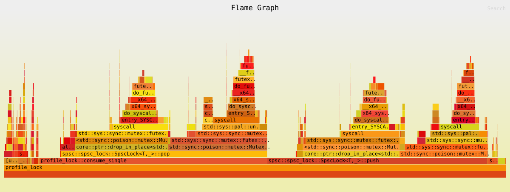
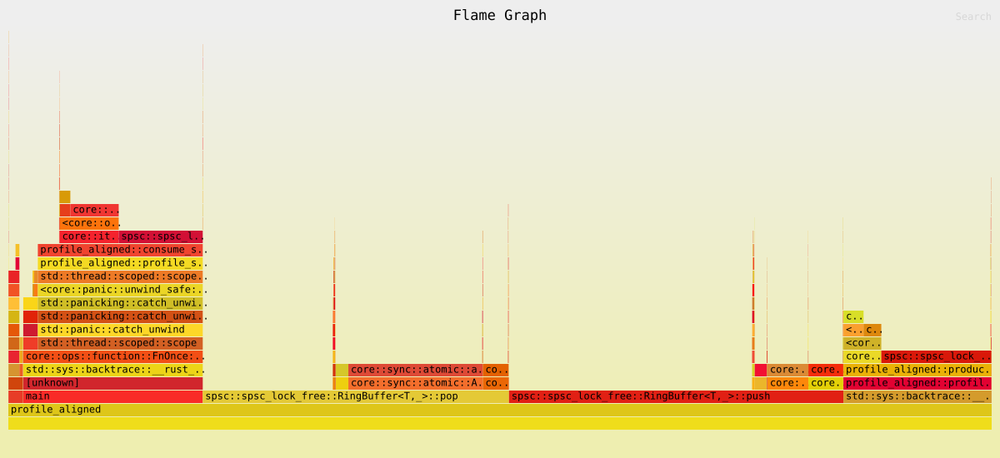

# Implementing the SPSC Queue in Rust

In this document, we will implement a Single Producer Single Consumer (SPSC) queue in Rust. An SPSC queue is a data structure that allows one producer thread to enqueue items and one consumer thread to dequeue items without the need for locks, making it efficient for concurrent programming.

We have previously discussed about the cache management in Rust here : [Cache Management in Rust](cache-management.md). Now, let's dive into the implementation of the SPSC queue.

## SPSC with mutex VecDeque

We could use a `VecDeque` wrapped in a `Mutex` to create a simple SPSC queue. However, this approach would involve locking and unlocking the mutex for every enqueue and dequeue operation, which can lead to contention and reduced performance.

```rust
use std::sync::Mutex;
use std::collections::VecDeque;

pub struct SpscLock<T, const N: usize> {
    buffer: Mutex<VecDeque<T>>,
}

impl<T, const N: usize> SpscLock<T, N> {
    pub fn new() -> Self {
        SpscLock {
            buffer: Mutex::new(VecDeque::with_capacity(N)),
        }
    }

    pub fn push(&self, item: T) -> Result<(), T> {
        let mut buf = self.buffer.lock().unwrap();
        if buf.len() < N {
            buf.push_back(item);
            Ok(())
        } else {
            Err(item)
        }
    }

    pub fn pop(&self) -> Option<T> {
        let mut buf = self.buffer.lock().unwrap();
        buf.pop_front()
    }
}
```

I run a test to check how long it takes to process 500 000 000 items with this implementation. It took **58.453773540** seconds, which is quite slow due to the locking overhead. 

I generated the flamegraph for this implementation and it shows that a significant amount of time (~60%) is spent on locking and unlocking the mutex instead of doing actual work on the queue operations. It also shows that syscalls related to locking are taking a lot of CPU time, which indicates contention on the mutex.



## SPSC with Custom Ring Buffer

To avoid the overhead of locking, we can implement a custom ring buffer that allows for lock-free operations. This implementation will use atomic operations to manage the head and tail indices of the buffer.

### Ring Buffer Types

```rust 
#[repr(align(64))]
pub struct CachePadded<T>(T);

#[repr(align(64))]
pub struct AlignedBuffer<T, const N: usize>([MaybeUninit<T>; N]);
```

As discussed in the cache management section, we use `CachePadded` to prevent false sharing between the head and tail indices. The `AlignedBuffer` is used to ensure that the buffer is aligned to a cache line boundary, which can improve performance.

The buffer is composed of an array of `MaybeUninit<T>` to allow for uninitialized memory, which is necessary for a lock-free implementation.

`MaybeUninit<T>` is the barebone version of `Option<T>` that allows us to work with uninitialized memory safely. Almost all operations on the buffer will involve unsafe code, so we need to be careful to ensure that we maintain safety guarantees.

The safety of the implementation relies on the fact that only the producer thread will write to the buffer and only the consumer thread will read from it.

### Ring Buffer Structure

```rust
pub struct RingBuffer<T, const N: usize> {
    pub head: CachePadded<AtomicUsize>,
    pub tail: CachePadded<AtomicUsize>,
    buffer: UnsafeCell<AlignedBuffer<T, N>>,    // Circular buffer storage, Make the whole buffer UnsafeCell to allow interior mutability
}
```

In this implementation, we use `AtomicUsize` for the head and tail indices to allow for lock-free operations. The `CachePadded` wrapper is used to prevent false sharing between the head and tail indices, which can improve performance.

We also use `UnsafeCell` for the buffer to allow for interior mutability, which is necessary for a lock-free implementation.

```rust
// Safety: The RingBuffer can be safely sent between threads as long as T is Send
unsafe impl<T: Send, const N: usize> Send for RingBuffer<T, N> {}
// Safety: The RingBuffer can be safely shared between threads as long as T is Send
unsafe impl<T: Send, const N: usize> Sync for RingBuffer<T, N> {}
```

The `Send` and `Sync` traits are implemented to allow the `RingBuffer` to be safely sent and shared between threads, as long as the type `T` is `Send`.

### Push Method

Let's dive into the `push` method.

```rust
pub fn push(&self, item: T) -> Result<(), T> {
    let head = self.head.0.load(Ordering::Relaxed); // Relaxed is safe here because only the consumer modifies head
    let next_head = (head + 1) & (N - 1); // Bitwise mask because N is power of 2

    let tail_relaxed = self.tail.0.load(Ordering::Relaxed); // Acquire to synchronize with consumer

    if next_head != tail_relaxed {
        fence(Ordering::Acquire);
        // Space available, fast path
        unsafe {
                *self.buffer
                .get()
                .as_mut()
                .unwrap()
                .0
                .get_unchecked_mut(head) = MaybeUninit::new(item);
    }

    self.head.0.store(next_head, Ordering::Release);
    return Ok(());
}

let mut tail = self.tail.0.load(Ordering::Acquire); // Acquire to synchronize with consumer

if next_head == tail {
    // Buffer is full
    let mut spin = 1;

    loop {
        for _ in 0..spin { std::hint::spin_loop(); }

        tail = self.tail.0.load(Ordering::Acquire); // Acquire to synchronize with consumer

        if next_head != tail {
            // Space available
            break;
        }

        if spin < SPIN_THRESHOLD {
            spin *= 2; // backoff
        } else {
            return Err(item);
        }
    }
    
}
```


In the `push` method, we first load the current head index using `Relaxed` ordering, which is safe because only the producer thread modifies the head. We then calculate the next head index using a bitwise mask, which is efficient because `N` is a power of 2.

Next, we load the tail index using `Relaxed` ordering to check if there is space available in the buffer. If the next head index is not equal to the tail index, it means there is space available, and we can proceed with the fast path. 

#### Hot Path (Uncontended)

We use `fence(Ordering::Acquire)` to ensure that all previous writes to the buffer are visible to the consumer thread before we update the head index. We then write the item to the buffer and store the next head index using `Release` ordering to ensure that the write to the buffer is visible to the consumer thread.

#### Cold Path (Contended)

If the next head index is equal to the tail index, it means the buffer is full. In this case, we enter a loop where we use `spin_loop` to yield the CPU and reduce contention. We also implement an exponential backoff strategy to avoid busy-waiting for too long.

We continue to check the tail index until there is space available in the buffer. If we exceed a certain spin threshold, we return an error indicating that the buffer is full.

We have decided to not return an error immediately when the buffer is full, but instead to spin for a while to give the consumer thread a chance to catch up and free up space in the buffer. We assume an high throughput scenario where the producer is faster than the consumer, so we want to avoid unnecessary errors and allow for some flexibility in the timing of the producer and consumer threads.

#### Note from Rust Documentation
`spin_loop` emits a machine instruction to signal the processor that it is running in a busy-wait spin-loop (“spin lock”).

Upon receiving the spin-loop signal the processor can optimize its behavior by, for example, saving power or switching hyper-threads.

This function is different from `thread::yield_now` which directly yields to the system’s scheduler, whereas `spin_loop` does not interact with the operating system.

### Pop Method

Now, let's look at the `pop` method.

```rust
    pub fn pop(&self) -> Option<T> {
        let relaxed_head = self.head.0.load(Ordering::Relaxed); // Acquire to synchronize with producer
        let tail = self.tail.0.load(Ordering::Relaxed); // Relaxed is safe here because only the consumer modifies tail 
    
        if relaxed_head != tail {
            fence(Ordering::Acquire);
            // Data available, fast path
            let item = unsafe {
                self.buffer.get()
                    .as_mut()
                    .unwrap()
                    .0
                    .get_unchecked_mut(tail)
                    .as_ptr()
                    .read()
            };

            let next_tail = (tail + 1) & (N - 1); // Bitwise mask because N is power of 2
            self.tail.0.store(next_tail, Ordering::Release);
            
            return Some(item);
        }

        let mut head = self.head.0.load(Ordering::Acquire); // Acquire to synchronize with producer
        if head == tail {
            let mut spin = 1;

            loop {
                for _ in 0..spin { std::hint::spin_loop(); }

                head = self.head.0.load(Ordering::Acquire); // Acquire to synchronize with producer

                if head != tail {
                    // Data available
                    break;
                }

                if spin < SPIN_THRESHOLD {
                    spin *= 2; // backoff
                } else {
                    return None;
                }
            }
        }


        // Synchronize with producer to ensure we see the latest data, improve atomic load performance when buffer is not empty
        //fence(Ordering::Acquire);

        let item = unsafe {
            self.buffer.get()
                .as_mut()
                .unwrap()
                .0
                .get_unchecked_mut(tail)
                .as_ptr()
                .read()
        };

        let next_tail = (tail + 1) & (N - 1); // Bitwise mask because N is power of 2
        self.tail.0.store(next_tail, Ordering::Release);
        Some(item)
    }
```

The `pop` method is similar to the `push` method but in reverse. We first load the head and tail indices to check if there is data available in the buffer. If there is data available, we read the item from the buffer and update the tail index. 

If the buffer is empty, we enter a loop where we use `spin_loop` to yield the CPU and reduce contention, similar to the `push` method.

#### Note on `N-1` Masking

The use of `N-1` for masking is a common technique in ring buffer implementations when the size of the buffer is a power of 2. This allows us to wrap around the indices efficiently without needing to use a modulus operation, which can be more expensive.

By using a bitwise AND operation with `N-1`, we can ensure that the indices wrap around correctly when they reach the end of the buffer. This is a key optimization that contributes to the performance of the ring buffer implementation.

However, when compiling with optimizations, the generated assembly code is the same whether we use `N-1` or a modulus operation, as the compiler is smart enough to optimize the modulus operation into a bitwise AND when `N` is a power of 2. 

Therefore, the choice between using `N-1` or a modulus operation is more about code clarity and convention in ring buffer implementations rather than performance.

### Split Method

We have decided to implement a `split` method that returns separate producer and consumer handles to the ring buffer. This allows for better encapsulation and separation of concerns between the producer and consumer threads.

```rust
    pub fn split<'a>(&'a mut self) -> (Producer<'a, T, N>, Consumer<'a, T, N>) {
        *self = Self::new(); // Reset head and tail to 0, ensure buffer is empty
        (
            Producer { 
                rb: self,
                // consumer_thread: std::thread::current(), // Store the consumer thread handle to allow for better synchronization in push when buffer is full, by yielding to the consumer thread
            },
            Consumer {
                rb: self,
                // _no_send: PhantomData, // Make Consumer !Send to prevent accidentally sending it to another thread, since it holds a reference to the RingBuffer which is shared with the Producer
            }
        )
    }
```

### Performance Comparison

To compare the performance of the SPSC queue with and without padding, we can use the `perf` tool to measure various metrics such as execution time, cache misses, and CPU cycles. We can run the producer and consumer threads for a fixed number of iterations (e.g., 500 million items) and collect the performance data.

```
╔═══════════════════════════════════════════════════════════════════╗
║                Lock free vs Mutex                   ║             ║
╠═════════════════════╪═══════════════╪═══════════════╪═════════════╣
║ Metric              │ Lock free     │ Mutex         │ Difference  ║
╠═════════════════════╪═══════════════╪═══════════════╪═════════════╣
║ Time (s)            │  5.934681717  │ 56.143732991  │     846.03% ║
║ Cache Misses        │  535,292,116  │ 2,175,736,688 │     -99.63% ║
║ L1 Cache Misses     │ 1,075,648,986 │ 2,762,560,625 │     100.00% ║
║ L2 Cache Misses     │  534,222,009  │ 2,175,237,215 │     -99.63% ║
╚═════════════════════╧═══════════════╧═══════════════╧═════════════╝
```

The results show that the lock-free implementation is significantly faster than the mutex-based implementation, with a much lower number of cache misses. This indicates that the lock-free implementation is more efficient in terms of both execution time and cache performance, likely due to the reduced contention and better cache locality.

### Flamegraph Analysis



The flamegraph for the lock-free implementation shows that the majority of the time is spent in the actual push and pop operations, with very little time spent on synchronization or waiting. This indicates that the lock-free implementation is effectively utilizing the CPU and minimizing contention between the producer and consumer threads.

The `push` and `pop` methods are evenly distributed in terms of CPU time, which suggests that both the producer and consumer threads are efficiently processing items without significant bottlenecks.

### RingBuffer vs Crossbeam ArrayQueue

To compare the performance of our custom `RingBuffer` implementation with the `ArrayQueue` from the Crossbeam library, we can run benchmarks for both implementations under the same conditions (e.g., processing 1 000 000 items) and collect performance metrics such as execution time and cache misses using `criterion`.

Here are the results of the benchmark:

```
╔══════════════════════════════════════════════════════╗
║          SPSC Queue Latency Comparison               ║
║          (1000000 iterations per benchmark)          ║
╠══════════════════════════════════════════════════════╣
║ Metric      │ RingBuffer │ Crossbeam   │ Difference  ║
╠═════════════╪════════════╪═════════════╪═════════════╣
║ p50 latency │  188543 ns │   255359 ns │   1.35x     ║
║ p99 latency │  207615 ns │   349183 ns │   1.68x     ║
╚═════════════╧════════════╧═════════════╧═════════════╝
  ✓ RingBuffer is 1.35x faster at p50
  ✓ RingBuffer is 1.68x faster at p99
```

The benchmark results show that our custom `RingBuffer` implementation has significantly lower latency compared to the `Crossbeam ArrayQueue`, with a 1.35x improvement at the 50th percentile and a 1.68x improvement at the 99th percentile. This indicates that our lock-free implementation is more efficient in terms of latency, likely due to reduced contention and better cache performance.

### Batching

When realizing the `perf` benchmarks, I noticed one metric was not as good as I expected: the number of instructions per cycle.

```
    20,190,628,527      instructions                     #    0.51  insn per cycle
```

This indicates that the CPU spend half of time in idle mode, waiting for the producer or consumer to catch up. To improve this metric, we could implement batching in our `RingBuffer` implementation, allowing the producer and consumer to process multiple items at once.

One implement of push batch could look like this:

```rust
pub fn push_batch(&self, items: &[T]) -> usize 
    where T: Copy
    {
        let mut pushed = 0;
        
        let mut head = self.head.0.load(Ordering::Relaxed); // Relaxed is safe here because only the consumer modifies head
        let tail = self.tail.0.load(Ordering::Acquire); // Acquire to synchronize with consumer
    
        for &item in items {
            let next_head = (head + 1) & (N - 1); // Bitwise mask because N is power of 2

            if next_head == tail {
                // Buffer is full
                break;
            }

            // Synchronize with consumer to ensure we see the latest data, improve atomic load performance when buffer is not full
            //fence(Ordering::Acquire);

            unsafe {
                 *self.buffer
                    .get()
                    .as_mut()
                    .unwrap()
                    .0
                    .get_unchecked_mut(head) = MaybeUninit::new(item);
            }

            head = next_head;
            pushed += 1;
        }

        self.head.0.store(head, Ordering::Release);
    
        pushed
    }
```

In this implementation, the `push_batch` method takes a slice of items and attempts to push as many items as possible into the buffer until it is full. The method returns the number of items that were successfully pushed.

Let's check how this implementation performs compared to the single-item `push` method.

```
 Performance counter stats for 'target/profiling/examples/profile_aligned':

     7,114,050,717      cycles                                                                  (62.45%)
    15,133,452,631      instructions                     #    2.13  insn per cycle              (62.39%)
       122,453,399      cache-misses                                                            (62.39%)
     3,507,026,175      L1-dcache-loads                                                         (62.43%)
       248,756,610      L1-dcache-load-misses            #    7.09% of all L1-dcache accesses   (62.52%)
        47,767,775      L1-icache-loads                                                         (62.62%)
            20,165      L1-icache-load-misses            #    0.04% of all L1-icache accesses   (62.64%)
       122,592,131      l2_cache_req_stat.ic_dc_miss_in_l2                                        (62.56%)

       0.911267407 seconds time elapsed

       1.815547000 seconds user
       0.003999000 seconds sys
```

The number of instructions per cycle has significantly improved from 0.51 to 2.13, indicating that the CPU is now more efficiently utilizing its resources and spending less time idle. The number of cache misses has also decreased, which suggests that the batching implementation is improving cache locality and reducing contention between the producer and consumer threads.

Finally, the overall execution time has decreased from **5.934681717 seconds** to **0.911267407 seconds**, between single-item and batch-push operations, which is a significant improvement in performance.

Number of items per batch should be tuned according to the workload characteristics and the size of the buffer to achieve optimal performance.

### Possible Improvements

In this final section, we can discuss potential improvements to the SPSC queue implementation.

#### Thread Parking

We discussed the possibility of using thread parking instead of spinning when the buffer is full or empty. This could potentially reduce CPU usage and improve performance in scenarios where the producer and consumer threads have significantly different processing speeds.

However, this implementation added complexity and overhead due to the need for additional synchronization mechanisms (e.g., condition variables) to wake up the parked thread when space becomes available in the buffer. So the performance benefits may not be significant in high-throughput scenarios where the producer and consumer threads are relatively balanced.

#### Thread Sleeping

Another potential improvement is to use thread sleeping instead of spinning when the buffer is full or empty. This approach can further reduce CPU usage by putting the thread to sleep for a short duration, allowing other threads to execute.

However, similar to thread parking, this method introduces additional complexity and may not provide significant performance gains in high-throughput scenarios where the producer and consumer threads are relatively balanced.

In all cases, it is a bad idea to use sleep in an high throughput scenario, as it can lead to increased latency and reduced performance due to the overhead of sleeping and waking up threads.

#### Backoff Strategies

We can also explore different backoff strategies for the spinning loops in the `push` and `pop` methods. For example, we could implement a more sophisticated exponential backoff strategy or use a randomized backoff to reduce contention between threads.

The `spin_loop` backoff strategy we implemented is a simple exponential backoff, which is effective in reducing contention while still allowing for quick recovery when space becomes available in the buffer. However, there may be other backoff strategies that could provide better performance in certain scenarios, such as a randomized backoff or a hybrid approach that combines spinning with thread parking.

#### Better latency metrics

In our benchmarks, I used `Instant::now()` to measure the latency of the `push` and `pop` operations. However, this method may not provide the most accurate latency measurements due to potential overhead from the system clock and other factors.

If I wanted to measure a more precise latency (eg p99.9), I could use a high-resolution timer such as `rdtsc` on x86 architectures, which provides a more accurate measurement of CPU cycles. This would allow us to get a better understanding of the latency characteristics of our implementation, especially in scenarios where the latency is critical.

## Conclusion

In this document, we have implemented a lock-free SPSC queue in Rust using a custom ring buffer. We compared the performance of our implementation with a mutex-based approach and found that the lock-free implementation is significantly faster and has better cache performance.

We also compared our implementation with the `Crossbeam ArrayQueue` and found that our custom `RingBuffer` has lower latency. Finally, we discussed potential improvements to the implementation, such as using thread parking or sleeping, and different backoff strategies. 

Depending on the use case and workload characteristics, further optimizations may be possible, but the current implementation provides a solid foundation for a high-performance SPSC queue in Rust.